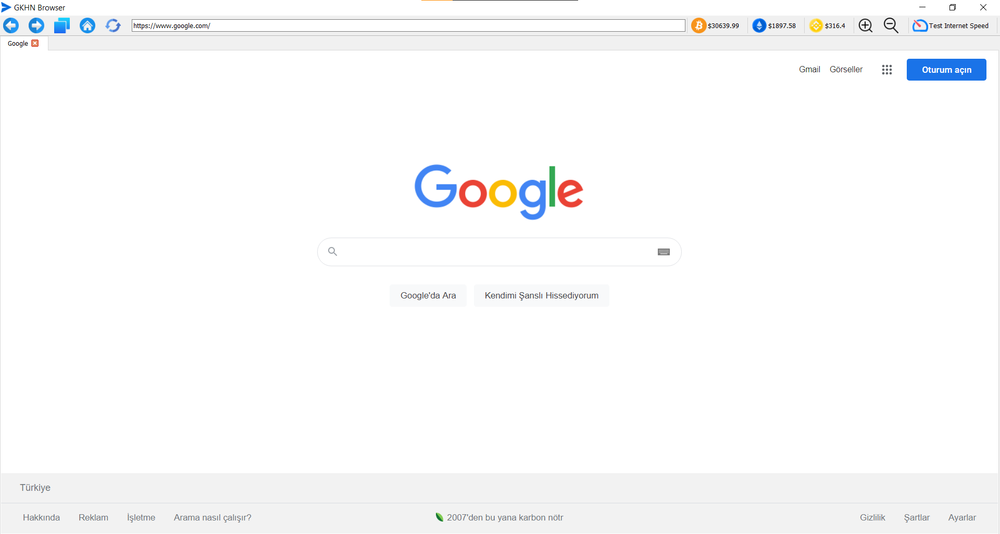

# browser_py
Simple internet browser writed with Python. (Chrome Based)
This browser can surf internet, download mp3 on YouTube videos, show cryptocurriencies, test internet speed.

Codes:

> from PyQt5.QtCore import *

> from PyQt5.QtGui import QIcon

> from PyQt5.QtWidgets import *

> from PyQt5.QtWebEngineWidgets import *

> import sys

> import speedtester

> import ccxt

> import threading

> import youtube_dl

class MainPage(QMainWindow):

    # this method is showing download button while you are at 'YouTube'
    # also looping cryptocurrencies
    def download_visibility(self):
        binance_api = ccxt.binance()
        while True:
            bitcoin_price = binance_api.fetch_ticker('BTC/USDT')
            self.btcLabel.setIconText(f"${bitcoin_price['bid']}")
            etherium_price = binance_api.fetch_ticker('ETH/USDT')
            self.ethLabel.setText(f"${etherium_price['bid']}")
            binancecoin_price = binance_api.fetch_ticker('BNB/USDT')
            self.bnbLabel.setText(f"${binancecoin_price['bid']}")
            if self.searchEntry.text().startswith("https://www.youtube") \
                    and not self.searchEntry.text() == "https://www.youtube.com/":
                self.downloadButton.setVisible(True)
            else:
                self.downloadButton.setVisible(False)
            if not QMainWindow.isVisible(self):
                break

    # this method for testing internet speed
    def spdtst(self):
        def trid():
            for i in range(1):
                self.linkBar.addWidget(self.spdTstLabel)
                self.spdTstLabel.setText(f"Testing...")
                try:
                    speed = float('%.2f' % (speedtester.get_speed()))
                    self.spdTstLabel.setText(f"{speed} mb/s")
                except:
                    self.spdTstLabel.setText("Error.")
                break

        self.tst = threading.Thread(target=trid, daemon=True)
        self.tst.start()

    # initialize method
    def __init__(self, *args, **kwargs):
        super(MainPage, self).__init__(*args, **kwargs)

        self.tabs = QTabWidget()
        self.tabs.setTabsClosable(True)
        self.tabs.tabCloseRequested.connect(self.close_current_tab)

        self.setToolButtonStyle(Qt.ToolButtonTextBesideIcon)
        self.add_new_tab(QUrl('http://www.google.com'), 'Homepage')
        self.tabs.currentWidget().page().profile().downloadRequested.connect(self.on_downloadRequested)
        self.tabs.currentWidget().page().fullScreenRequested.connect(lambda request: request.accept())

        self.setCentralWidget(self.tabs)
        self.showMaximized()

        # creating bars
        self.linkBar = QToolBar("Adres Çubuğu")
        self.linkBar.setFloatable(False)
        self.linkBar.setMovable(False)
        self.addToolBar(self.linkBar)

        # creating button for return last page
        backButton = QAction(self)
        backButton.setToolTip('Back')
        backButton.setIcon(QIcon('icns/previous.png'))
        backButton.triggered.connect(lambda: self.tabs.currentWidget().back())
        self.linkBar.addAction(backButton)

        # creating button for go to next page
        nextButton = QAction(self)
        nextButton.setToolTip('Forward')
        nextButton.setIcon(QIcon('icns/nextbutton.png'))
        nextButton.triggered.connect(lambda: self.tabs.currentWidget().forward())
        self.linkBar.addAction(nextButton)

        # creating add a new tab button
        newTabButton = QAction(self)
        newTabButton.setIcon(QIcon('icns/tabs.png'))
        newTabButton.setToolTip('New Tab')
        newTabButton.triggered.connect(self.add_new_tab)
        self.linkBar.addAction(newTabButton)

        # creating button for go to home page
        homeButton = QAction(self)
        homeButton.setToolTip('Home')
        homeButton.setIcon(QIcon('icns/homebutton.png'))
        homeButton.triggered.connect(self.navigate_home)
        self.linkBar.addAction(homeButton)

        # creating button for refresh current page
        refreshButton = QAction(self)
        refreshButton.setIcon(QIcon('icns/refresh.png'))
        refreshButton.setToolTip('Refresh')
        refreshButton.triggered.connect(lambda: self.tabs.currentWidget().reload())
        self.linkBar.addAction(refreshButton)
        self.downloadLabel = QLabel()
        self.linkBar.addWidget(self.downloadLabel)

        # creating edit line for write links
        self.searchEntry = QLineEdit()
        self.searchEntry.returnPressed.connect(self.navigate_to_url)
        self.searchEntry.setAlignment(Qt.AlignLeft)
        self.linkBar.addWidget(self.searchEntry)

        self.tabs.currentChanged.connect(self.current_tab_changed)

        # creating button for download mp3 from YouTube video
        self.downloadButton = QAction('Download MP3', self)
        self.downloadButton.setIcon(QIcon('icns/download.png'))
        self.downloadButton.triggered.connect(self.start_downloading)
        self.downloadButton.setVisible(False)
        self.linkBar.addAction(self.downloadButton)
        self.linkBar.addSeparator()
        self.dwnldThread = threading.Thread(target=self.download_visibility)
        self.dwnldThread.start()

        # creating button for zoom in or zoom out page
        zoomPlusButton = QAction(self)
        zoomPlusButton.setToolTip('Zoom In')
        zoomPlusButton.setIcon(QIcon('icns/zoom-in.png'))
        zoomPlusButton.triggered.connect(self.zoom_in)
        zoomMinusButton = QAction(self)
        zoomMinusButton.setToolTip('Zoom Out')
        zoomMinusButton.setIcon(QIcon('icns/zoom-out.png'))
        zoomMinusButton.triggered.connect(self.zoom_out)

        # creating button for test internet speed
        spdtstButton = QAction('Test Internet Speed', self)
        spdtstButton.setIcon(QIcon('icns/speed.png'))
        spdtstButton.triggered.connect(self.spdtst)

        # creating label for speed test results
        self.spdTstLabel = QLabel("Testing...")
        # creating button for bitcoin currency and go to trade page
        self.btcLabel = QAction()
        self.btcLabel.setIcon(QIcon('icns/bitcoin.png'))
        self.btcLabel.setToolTip("Bitcoin")
        self.btcLabel.triggered.connect(self.goBtcPage)
        # creating button for ethereum currency and go to trade page
        self.ethLabel = QAction()
        self.ethLabel.setIcon(QIcon('icns/ethereum.png'))
        self.ethLabel.setToolTip("Ethereum")
        self.ethLabel.triggered.connect(self.goEthPage)
        # creating button for binance coin currency and go to trade page
        self.bnbLabel = QAction()
        self.bnbLabel.setIcon(QIcon('icns/binance.png'))
        self.bnbLabel.setToolTip("Binance Coin")
        self.bnbLabel.triggered.connect(self.goBnbPage)

        # adding to linkbar created buttons
        self.linkBar.addAction(self.btcLabel)
        self.linkBar.addSeparator()
        self.linkBar.addAction(self.ethLabel)
        self.linkBar.addSeparator()
        self.linkBar.addAction(self.bnbLabel)
        self.linkBar.addSeparator()
        self.linkBar.addAction(zoomPlusButton)
        self.linkBar.addAction(zoomMinusButton)
        self.linkBar.addSeparator()
        self.linkBar.addAction(spdtstButton)
        self.linkBar.addSeparator()

    # this method for write link at edit line where is page
    def bring_link(self, link):
        self.searchEntry.setText(link.toString())

    # this method for download mp3
    def start_downloading(self):
        def trid():
            for i in range(1):
                try:
                    video_url = self.searchEntry.text()
                    video_info = youtube_dl.YoutubeDL().extract_info(
                        url=video_url, download=False)
                    file_name = f"{video_info['title']}.mp3"
                    settings = {
                        'format': 'bestaudio/best',
                        'keepvideo': False,
                        'outtmpl': file_name,
                    }
                    self.downloadLabel.setText(f"Downloading - {file_name}")
                    with youtube_dl.YoutubeDL(settings) as ydl:
                        ydl.download([video_info['webpage_url']])
                        self.downloadLabel.setText(f"Downloaded ✓ - {file_name}")
                    break
                except:
                    print('hata')
                    break

        dwn = threading.Thread(target=trid)
        dwn.start()

    # method for zoom in browser
    def zoom_in(self):
        self.tabs.currentWidget().setZoomFactor(self.tabs.currentWidget().zoomFactor() + 0.1)

    # method for zoom out in browser
    def zoom_out(self):
        self.tabs.currentWidget().setZoomFactor(self.tabs.currentWidget().zoomFactor() - 0.1)

    # method for go to bitcoin trade button
    def goBtcPage(self):
        btc_url = 'https://www.binance.com/en/trade/BTC_USDT'
        self.tabs.currentWidget().setUrl(QUrl(btc_url))

    # method for go to ethereum trade button
    def goEthPage(self):
        eth_url = 'https://www.binance.com/en/trade/ETH_USDT'
        self.tabs.currentWidget().setUrl(QUrl(eth_url))

    # method for go to binance coin trade button
    def goBnbPage(self):
        bnb_url = 'https://www.binance.com/en/trade/BNB_USDT'
        self.tabs.currentWidget().setUrl(QUrl(bnb_url))

    def add_new_tab(self, qurl: str, label="Blank"):
        # if url is blank
        if qurl == '':
            # creating a google url
            qurl = QUrl('http://www.google.com')

        # if new tab request
        if qurl == False:
            qurl = QUrl('http://www.google.com')

        # creating a QWebEngineView object
        browser = QWebEngineView()

        # setting url to browser
        browser.setUrl(qurl)
        browser.setZoomFactor(1.2)
        # setting tab index
        i = self.tabs.addTab(browser, label)
        self.tabs.setCurrentIndex(i)

        # adding action to the browser when url is changed
        # update the url
        browser.urlChanged.connect(lambda qurl, browser=browser:
                                   self.update_urlbar(qurl, browser))

        # adding action to the browser when loading is finished
        # set the tab title
        browser.loadFinished.connect(lambda _, i=i, browser=browser:
                                     self.tabs.setTabText(i, browser.page().title()))

        # when tab is changed

    def current_tab_changed(self, i):
        try:
            # get the curl
            qurl = self.tabs.currentWidget().url()

            # update the url
            self.update_urlbar(qurl, self.tabs.currentWidget())

            # update the title
            self.update_title(self.tabs.currentWidget())
        except:
            return

    # when tab is closed
    def close_current_tab(self, i):
        self.tabs.removeTab(i)

    # method for updating the title
    def update_title(self, browser):

        # if signal is not from the current tab
        if browser != self.tabs.currentWidget():
            # do nothing
            return

        # get the page title
        title = self.tabs.currentWidget().page().title()

    # action to go to home page
    def navigate_home(self):
        if self.tabs.count() > 0:
            # go to google
            self.tabs.currentWidget().setUrl(QUrl("http://www.google.com"))

    # method for navigate to url
    def navigate_to_url(self):

        if self.searchEntry.text().startswith('www.') and self.searchEntry.text().endswith('.com'):
            url = 'https://' + self.searchEntry.text()
            self.tabs.currentWidget().setUrl(QUrl(url))

        elif self.searchEntry.text().endswith('.com') and (not self.searchEntry.text().startswith('https://')
                                                           or self.searchEntry.text().startswith('http://')):
            url = 'https://www.' + self.searchEntry.text()
            self.tabs.currentWidget().setUrl(QUrl(url))

        elif self.searchEntry.text().startswith('http'):
            url = self.searchEntry.text()
            self.tabs.currentWidget().setUrl(QUrl(url))

        # if user don't write right link, then search in google
        elif not self.searchEntry.text().startswith('www.') and not self.searchEntry.text().endswith('.com'):
            url = 'https://www.google.com/search?q=' + self.searchEntry.text()
            self.tabs.currentWidget().setUrl(QUrl(url))
        else:
            url = self.searchEntry.text()
            self.tabs.currentWidget().setUrl(QUrl(url))

    # method to update the url
    def update_urlbar(self, q, browser=None):

        # If this signal is not from the current tab, ignore
        if browser != self.tabs.currentWidget():
            return

        # set text to the url bar
        self.searchEntry.setText(q.toString())

        # set cursor position
        self.searchEntry.setCursorPosition(0)

    def contextMenuEvent(self, event):
        self.menus = QMenu()
        action = self.menus.addAction(QIcon('C:/phytonicns/tabs.png'), 'New Tab')
        action.triggered.connect(self.add_new_tab)
        self.menus.popup(event.globalPos())

    pyqtSlot("QWebEngineDownloadItem*")

    def on_downloadRequested(self, download):
        old_path = download.url().path()  # download.path()
        suffix = QFileInfo(old_path).completeSuffix()
        path, _ = QFileDialog.getSaveFileName(
            self, "Save File", old_path, f"*.{suffix}"
        )
        if path:
            download.setPath(path)
            download.accept()
            download.finished.connect(self.foo)

    def foo(self):
        print("finished")

> Browser = QApplication(sys.argv)

> QApplication.setApplicationName("GKHN Browser")

> QApplication.setWindowIcon(QIcon('C:/phytonicns/sendmessage.png'))

> screen = MainPage()

> screen.show()

> Browser.exec()
